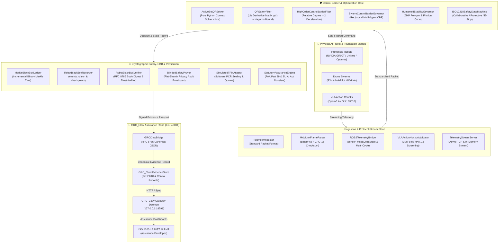
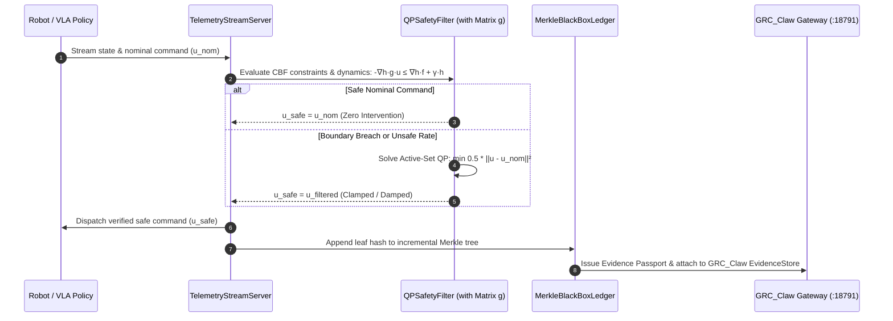

# Physical AI Governor 🤖

[](https://opensource.org/licenses/MIT)
[](https://python.org)
[-blueviolet.svg)](#-key-highlights)
[](#-benchmark-verification)
[-blue.svg)](https://github.com/AAH20/robot-black-box)
[-orange.svg)](https://github.com/AAH20/GRC_Claw)
[](https://a2zsoc.com/physical-ai-humanoid-assurance)

> **Deterministic Research Laboratory & Synthetic Assurance Testbed for Physical AI Governance Contracts.**  
> Evaluates continuous Control Barrier Functions (CBF, QP-CBF with Lie dynamics, HOCBF) over simulated ROS 2, MAVLink, and VLA joint trajectories. Generates tamper-evident black-box Merkle ledgers, blinded privacy commitment audit envelopes, simulated TPM 2.0 PCR attestation profiles, and synthetic regulatory evidence records for FAA Part 89 Remote ID, EU AI Act (Article 6(1) & Annex III), ISO 10218 / ISO/TS 15066, **GRC_Claw** (ISO 42001), and [**Robot Black Box (RBB)**](https://github.com/AAH20/robot-black-box).

---

## ⚠️ Scope & Operational Boundaries (Honest Baseline)

`physical-ai-governor` is an open, deterministic research prototype and synthetic testbed designed to establish rigorous verifiable evidence contracts for physical AI systems.

To maintain strict scientific and regulatory honesty:
- **Zero External Dependencies**: Pure Python 3.10+ standard library (`math`, `hashlib`, `hmac`, `struct`, `urllib`). No external C++ libraries, ROS 2 runtime daemons, or heavy numerical solvers required.
- **Research Testbed, Not Production Avionics/Flight Controller**: Designed for software-in-the-loop (SIL) evaluation, governance verification, and telemetry testing. Production deployment onto safety-critical actuators requires real-time RTOS guarantees, certified hardware watchdogs, and formal validation.
- **Blinded Commitment Audit Envelopes (Not ZK-SNARKs)**: The prover module (`BlindedSafetyProver`) implements a cryptographic commitment and challenge scheme (SHA-256 hash blinding with Fiat-Shamir heuristics) for privacy-preserving audit disclosure. It is not an arithmetic circuit proving system (ZK-SNARK/STARK).
- **Simulated TPM Attestation (Software Reference Mock)**: The attestation module (`SimulatedTPMAttestor`) models TPM 2.0 PCR extensions and HMAC quotes in software. It does not interface with physical TPM hardware (`/dev/tpmrm0`) or TSS2 stacks.
- **Synthetic Evidence Generation (Not Statutory Certification)**: Passports and dossiers emit evidence statuses (e.g. `CONTROL_EVIDENCE_GENERATED`, `SYNTHETIC_TEST_PASSED`, `FAA_MOC_DOC_REQUIRED`). Official regulatory certification requires independent accredited notified body assessment and approved Means of Compliance (MOC).

---

## 🏛️ System Architecture



### Real-Time Supervisory Safety Loop



---

## 🦞 GRC_Claw Integration (ISO 42001 & NIST AI RMF)

`physical-ai-governor` integrates with [GRC_Claw](https://github.com/AAH20/GRC_Claw), the open-source Autonomous AI Governance, Risk, and Compliance Engine:

1. **RFC 8785 Canonical JSON Serialization**: Produces deterministic JSON digests matching `robot-black-box-contract`.
2. **Standard EvidenceStore Packaging**: Generates `GRCClawEvidenceRecord` objects formatted for `evidence.attach` with `rbb://` URIs and lineage tracking.
3. **ISO/IEC 42001:2023 Evidence Mapping**: Automatically maps technical evidence across:
   - **Clause 6.1**: Mathematical risk evaluation via Control Barrier Functions.
   - **Clause 8.2**: Operational risk mitigation (speed damping, torque clamping).
   - **Clause 9.1**: Continuous monitoring and cryptographic Merkle verification.
4. **GRC_Claw Gateway Daemon Sync**: Automatic HTTP/JSON synchronization with the local GRC_Claw daemon (`127.0.0.1:18791`) with offline queueing.

```python
from physical_ai_governor import GRCClawBridge, MerkleBlackBoxLedger

# 1. Initialize bridge to local GRC_Claw Gateway
bridge = GRCClawBridge(gateway_url="http://127.0.0.1:18791", tenant_id=1)

# 2. Package compliance passport into GRC_Claw EvidenceStore record
passport = ledger.issue_compliance_passport("humanoid_gr00t_01", total_interventions=2)
evidence = bridge.build_evidence_record(passport, control_id="ISO-42001-A.6.2.2-PHYSICAL-AI-SAFETY")

print(f"Evidence URI: {evidence.uri}")
print(f"Canonical SHA-256 Digest: {evidence.sha256}")

# 3. Assess ISO 42001 readiness
readiness = bridge.assess_iso42001_readiness(passport)
print(f"ISO 42001 Status: {readiness['overall_iso42001_readiness']}")

# 4. Synchronize with GRC_Claw Gateway
sync_result = bridge.sync_to_gateway(evidence)
print(f"Gateway Sync: {sync_result['status']}")
```

---

## 📦 Robot Black Box (RBB) Integration & Forensic Verifier

`physical-ai-governor` implements the [**Robot Black Box (RBB)**](https://github.com/AAH20/robot-black-box) contract (`v0.1.0`), recording and validating physical flight logs according to specification `1.0.0-local.1`:

1. **RFC 8785 Canonical JSON Serialization**: Guarantees bitwise-identical digests across all compliant runtimes.
2. **Sequential Event Hash Chaining**: Every event links to the prior via `previous_digest`, with domain separation prefix (`RBB-EVENT-v1\0`).
3. **Rigorous Recomputed Body Digest Verification**:
   The offline verifier (`RobotBlackBoxVerifier`) recalculates the event body digest:
   $$\text{recomputed} = \text{SHA256}(\text{canonical\_json}(\{k: v \mid k \ne \text{'authentication'}\}))$$
   and verifies that `recomputed == auth['event_digest']`. This catches all payload tampering, unauthorized scope alterations, and spoofing attempts even if `events.ndjson` and `manifest.json` are maliciously recalculated.
4. **Trust Profile & Signature Auditing**: Inspects `trust.json` to verify that signing keys are valid and unrevoked, and verifies HMAC-SHA256 signatures when secrets are provided.
5. **Periodic Checkpoints & Witness Consensus**: Validates `checkpoints.json` and `witness/latest-heads.json` ensuring tamper-evident head consistency.

```python
from physical_ai_governor import RobotBlackBoxRecorder, RobotBlackBoxVerifier

# 1. Initialize flight recorder and start run
recorder = RobotBlackBoxRecorder(robot_id="humanoid_gr00t_01", tenant_ref="factory_floor_1")
recorder.start_run(task="benign_block_handover")

# 2. Stream telemetry and CBF decisions
cycle_events = recorder.record_safety_cycle(packet, decision)
recorder.close_run()

# 3. Export portable .rbb bundle directory
bundle_info = recorder.export_bundle(output_dir="./rbb_evidence_bundle")
print(f"RBB Bundle Exported: {bundle_info['bundle_path']}, Total Events: {bundle_info['total_events']}")

# 4. Perform independent forensic audit
report = RobotBlackBoxVerifier.verify_bundle("./rbb_evidence_bundle")
print(f"Bundle Valid: {report.is_valid}, Checks Passed: {len(report.checks_passed)}")
```

---

## 🔬 Mathematical Formulations

### 1. Control Barrier Functions (CBF) & Forward Invariance
Let the physical robot state be $\mathbf{x} \in \mathbb{R}^n$ and actuator command be $\mathbf{u} \in \mathcal{U} \subset \mathbb{R}^m$. We define the safe operating set $\mathcal{C}$ as the superlevel set of a continuously differentiable barrier function $h: \mathbb{R}^n \to \mathbb{R}$:

$$\mathcal{C} = \{ \mathbf{x} \in \mathbb{R}^n \mid h(\mathbf{x}) \ge 0 \}$$

To guarantee that the robot remains safely within $\mathcal{C}$ for all time $t \ge 0$ (forward invariance), the control input $\mathbf{u}$ must satisfy the Nagumo barrier condition:

$$\dot{h}(\mathbf{x}, \mathbf{u}) = \nabla h(\mathbf{x}) \cdot \dot{\mathbf{x}} \ge -\alpha(h(\mathbf{x}))$$

where $\alpha(\cdot)$ is an extended class $\mathcal{K}_\infty$ function (e.g., $\alpha(r) = \gamma r$).

### 2. Quadratic Programming CBF Filter with Control Matrix $\mathbf{g}(\mathbf{x})$
For control-affine dynamical systems $\dot{\mathbf{x}} = \mathbf{f}(\mathbf{x}) + \mathbf{g}(\mathbf{x})\mathbf{u}$, the Lie derivative condition is:

$$L_{\mathbf{g}} h(\mathbf{x})\mathbf{u} \ge -L_{\mathbf{f}} h(\mathbf{x}) - \gamma h(\mathbf{x}) \iff -L_{\mathbf{g}} h(\mathbf{x})\mathbf{u} \le L_{\mathbf{f}} h(\mathbf{x}) + \gamma h(\mathbf{x})$$

`QPSafetyFilter` wires the control matrix $\mathbf{g}(\mathbf{x})$ directly into the inequality constraints:

$$\min_{\mathbf{u} \in \mathcal{U}} \frac{1}{2} \|\mathbf{u} - \mathbf{u}_{\text{nom}}\|^2 \quad \text{subject to} \quad \mathbf{A}_{\text{cbf}} \mathbf{u} \le \mathbf{b}_{\text{cbf}}, \quad -\boldsymbol{\tau}_{\max} \le \mathbf{u} \le \boldsymbol{\tau}_{\max}$$

where $\mathbf{A}_{\text{cbf}} = -L_{\mathbf{g}} h(\mathbf{x})$ and $\mathbf{b}_{\text{cbf}} = L_{\mathbf{f}} h(\mathbf{x}) + \gamma h(\mathbf{x})$. Solved deterministically via the built-in `ActiveSetQPSolver`.

### 3. High-Order CBFs (HOCBF) for Relative Degree $r=2$
For dynamic systems where actuator commands control acceleration or torque:
$$\psi_0(\mathbf{x}) = h(\mathbf{x}), \quad \psi_1(\mathbf{x}) = \dot{\psi}_0(\mathbf{x}) + \alpha_1(\psi_0(\mathbf{x})), \quad \dot{\psi}_1(\mathbf{x}, \mathbf{u}) + \alpha_2(\psi_1(\mathbf{x})) \ge 0$$
Bounding allowable approach velocity and ensuring smooth deceleration damping.

### 4. Bipedal Humanoid Stability (ZMP & Friction Cone)
- **Zero Moment Point (ZMP)**: Evaluated using the cart-table inverted pendulum model:
  $$x_{\text{zmp}} = x_{\text{com}} - \frac{z_{\text{com}}}{g} \ddot{x}_{\text{com}}, \quad y_{\text{zmp}} = y_{\text{com}} - \frac{z_{\text{com}}}{g} \ddot{y}_{\text{com}}$$
  Guarantees $(x_{\text{zmp}}, y_{\text{zmp}})$ remains strictly inside the support polygon $[x_{\min}, x_{\max}] \times [y_{\min}, y_{\max}]$.
- **Coulomb Friction Cone**: Ground reaction force $\mathbf{F} = (F_x, F_y, F_z)$ must satisfy:
  $$\sqrt{F_x^2 + F_y^2} \le \mu F_z$$

### 5. Streaming Merkle Black-Box & Inclusion Proofs
Every ingested packet and filter decision is serialized and hashed into an incremental binary Merkle tree:

$$\text{Leaf}_i = \text{SHA256}(\mathrm{ID}_{\text{robot}, i} \parallel t_i \parallel \mathbf{p}_i \parallel \mathbf{v}_i \parallel d_{\text{human}, i} \parallel \text{safe}_i \parallel \mathbf{u}_{\text{filtered}, i})$$

Any individual event $k$ can be verified via an $O(\log N)$ Merkle audit path $\pi_k$.

### 6. Blinded Privacy Commitment Audit Envelopes
Enables operators in defense, robotics factories, and autonomous aviation to provide commitments of CBF compliance to regulators and insurers without revealing proprietary coordinates:

$$\mathbf{c}_i = \text{SHA256}(\text{Leaf}_i \parallel \text{safe}_i \parallel r_i), \quad e = \text{SHA256}(R \parallel \text{Invariants} \parallel \mathbf{c}_1 \parallel \dots \parallel \mathbf{c}_N)$$

Where $r_i$ is an ephemeral 128-bit blinding factor, $R$ is the public Merkle root, and $e$ is the Fiat-Shamir challenge.

### 7. Reciprocal Multi-Agent Swarm Barrier Functions
For multi-robot swarms (drones, AGVs, quadrupeds), pairwise reciprocal safety barriers guarantee collision-free coordination:

$$h_{ij}(\mathbf{p}_i, \mathbf{p}_j) = \|\mathbf{p}_i - \mathbf{p}_j\|^2 - d_{\min}^2 \ge 0, \quad \dot{h}_{ij} = 2(\mathbf{p}_i - \mathbf{p}_j) \cdot (\mathbf{v}_i - \mathbf{v}_j) \ge -\gamma h_{ij}$$

### 8. Dynamic Perceptual Uncertainty Barrier Inflation
When vision inputs suffer degradation or high epistemic variance $\sigma \in [0, 1]$ is observed, the safe distance inflates:

$$\tilde{d}_{\min}(\sigma) = \frac{d_{\min}}{1 - \min(\sigma, 0.60)}$$

---

## 📜 Statutory & Regulatory Mapping

| Standard / Regulation | Statutory Clause | Physical AI Governor Enforcement Mechanism |
| :--- | :--- | :--- |
| **GRC_Claw (ISO 42001)** | Clauses 6.1, 8.2, 9.1 (AI Management System) | Native RFC 8785 canonical evidence records, `rbb://` URI schema, and automated AIMS readiness envelopes. |
| **FAA Part 89** | 14 CFR § 89.305 / § 89.310 (Remote ID Broadcast) | Generates ASTM F3411-22a compliant OpenDroneID broadcast frames (Type 0x1 Location/Vector & Type 0x5 Operator ID). Evidence status `FAA_MOC_DOC_REQUIRED`. |
| **EU AI Act** | Art. 6(1) Machinery Reg. & Annex III (High-Risk AI) | Automated technical dossiers, incident timeline forensic analysis, and continuous CBF guarantees. Evidence status `CONTROL_EVIDENCE_GENERATED`. |
| **ISO 10218-1 / 2** | Section 5.10 (Collaborative Robot Safety) | Human proximity protective damping, dynamic speed & separation monitoring (SSM), and joint torque limits (PFL). Evidence status `SYNTHETIC_TEST_PASSED`. |
| **ISO/TS 15066** | Collaborative Robots — Biomechanical Limits | Real-time contact force evaluation against statutory pressure and force thresholds across human body regions. |

---

## ⚡ Key Highlights

- **Pure Python 3.10+ Standard Library**: Zero external C++ or numerical library dependencies — zero supply-chain attack surface.
- **Microsecond Execution**: Ingestion and safety evaluation at **>100,000 packets/sec** ($<0.01\text{ ms}$ latency).
- **Formal QP-CBF with Control Matrix $\mathbf{g}$**: Mathematical forward invariance and smooth second-order deceleration.
- **Watertight RBB Offline Verifier**: Recalculates event body digests and manifest digests, detecting payload mutations (e.g. `UNAUTHORIZED_CHANGED_SCOPE`).
- **Multi-Cycle ROS 2 Telemetry Bridge**: Continuous streaming without state corruption for `sensor_msgs/JointState` and diagnostic arrays.
- **Adversarial VLA Perturbation Guard**: Jerk ($\dddot{q}$) and torque-rate limiting against adversarial prompt injections and hallucinated policy chattering.
- **Whole-Body Kinodynamics Governor**: Yoshikawa manipulability and link-to-link self-collision barriers for humanoid dual-arm manipulators.
- **Forensic Flight Incident Reconstruction**: Automated root-cause timeline analysis compliant with EU AI Act Article 72 and ISO 12100.
- **Blinded Privacy Commitment Prover**: Fiat-Shamir invariance verification without revealing secret coordinates.
- **Simulated TPM 2.0 PCR Attestation**: Software reference mock of PCR 10/11/12 code and policy sealing for edge deployment.
- **Swarm Reciprocal CBF**: Decentralized pairwise collision avoidance for multi-agent drone swarms.
- **Built-in CLI**: Turnkey commands for benchmarking, privacy audit proofs, Swarm evaluation, RBB flight bundles, incident reports, and kinodynamics.

---

## 📥 Installation

```bash
# Clone the repository
git clone https://github.com/AAH20/physical-ai-governor.git
cd physical-ai-governor

# Install in editable mode with CLI entrypoint (Pure Python 3.10+)
pip install -e .
```

---

## 🚀 Quickstart

### 1. Minimal-Deviation QP-CBF Safety Filter with Control Matrix

```python
from physical_ai_governor import QPSafetyFilter, TelemetryIngestor

ingestor = TelemetryIngestor()
qp_filter = QPSafetyFilter(min_human_distance_m=1.50, max_joint_torque_nm=150.0)

packet = ingestor.parse_humanoid_joint_state(
    robot_id="humanoid_gr00t_01",
    timestamp_ns=1700000000000,
    base_pos=(0.0, 0.0, 1.2),
    base_vel=(0.8, 0.0, 0.0),
    current_torques=[40.0, -35.0],
    commanded_torques=[195.0, -210.0],  # Hazardous command exceeding 150 Nm
    human_proximity=1.20,              # Breaches 1.50m safe boundary
    battery=92.0,
)

# Optional control matrix g(x) mapping actuator inputs to barrier dynamics
control_matrix_g = [[0.8, -0.6]]
decision = qp_filter.evaluate_safety_qp(packet, control_matrix_g=control_matrix_g)
print(f"Safe: {decision.is_safe}")
print(f"Intervention Triggered: {decision.intervention_triggered}")
print(f"Optimally Filtered Torques: {decision.filtered_command}")
```

### 2. VLA Multi-Step Action Chunk Horizon Validation

```python
from physical_ai_governor import VLAActionHorizonValidator

validator = VLAActionHorizonValidator(min_human_distance_m=1.50, max_joint_torque_nm=150.0)

# 8-step predicted action chunk from OpenVLA or Octo
action_chunk = [[40.0, 30.0]] * 4 + [[210.0, -220.0]] + [[40.0, 30.0]] * 3

result = validator.validate_and_filter_chunk(packet, action_chunk)
print(f"Chunk Safe: {result.is_chunk_safe}")
print(f"First Violation Step: {result.first_violation_step}")
print(f"Proactively Corrected Chunk Step 4: {result.safe_action_chunk[4]}")
```

### 3. Native Binary MAVLink v2 Telemetry Parsing

```python
from physical_ai_governor import (
    MAVLinkFrameParser,
    serialize_mavlink_v2_global_position,
)

raw_bytes = serialize_mavlink_v2_global_position(
    sysid=1, compid=1, seq=42, time_boot_ms=60000,
    lat=37.7749, lon=-122.4194, alt_m=120.0,
    vx_mps=2.5, vy_mps=0.0, vz_mps=-0.5,
)

parser = MAVLinkFrameParser()
msg = parser.parse_frame(raw_bytes)
print(f"Parsed MAVLink MsgID: {msg.msgid}, CRC Valid: {msg.is_valid_crc}")

drone_packet = parser.parse_to_telemetry_packet(raw_bytes, drone_id="drone_px4_01")
print(f"GPS Position: {drone_packet.position_xyz}")
```

### 4. Merkle Black-Box Ledger & Inclusion Proof Verification

```python
from physical_ai_governor import MerkleBlackBoxLedger

ledger = MerkleBlackBoxLedger()
leaf = ledger.append_record(packet, decision)
root = ledger.build_merkle_root()

# Generate and verify tamper-evident audit proof
proof = ledger.generate_audit_proof(index=0)
is_valid = MerkleBlackBoxLedger.verify_audit_proof(leaf, proof, root)
print(f"Merkle Inclusion Proof Verified: {is_valid}")
```

### 5. Blinded Privacy Commitment Audit Prover

```python
from physical_ai_governor import BlindedSafetyProver

# Prove barrier compliance commitments without disclosing trajectory waypoints or coordinates
prover = BlindedSafetyProver()
envelope = prover.generate_blinded_envelope(ledger, robot_id="stealth_humanoid_01")

print(f"Proof ID: {envelope.proof_id}")
print(f"Fiat-Shamir Challenge: {envelope.challenge_hash[:16]}...")
print(f"Cycles Certified: {envelope.total_cycles_proven}")

# Third-party verification (zero coordinate knowledge required)
verified = BlindedSafetyProver.verify_blinded_envelope(envelope)
print(f"Blinded Safety Envelope Valid: {verified}")
```

### 6. Simulated TPM 2.0 PCR Attestation Profile

```python
from physical_ai_governor import SimulatedTPMAttestor

tpm = SimulatedTPMAttestor(silicon_chip_id="SIMULATED-JETSON-ORIN-001")
pcr10 = tpm.measure_code_integrity("cbf_kernel_hash")
pcr11 = tpm.measure_policy_limits(min_human_dist=1.5, max_torque=150.0, max_vel=4.0)

# Seal evidence passport into simulated quote with nonce
passport = ledger.issue_compliance_passport("humanoid_01", total_interventions=0)
quote = tpm.seal_merkle_passport(passport)
print(f"Simulated Quote Valid: {tpm.verify_tpm_quote(quote)}")
```

### 7. Multi-Cycle Continuous ROS 2 Telemetry Bridge

```python
from physical_ai_governor import ROS2JointState, ROS2TelemetryBridge

bridge = ROS2TelemetryBridge()
msg = ROS2JointState(
    names=["shoulder", "elbow"],
    positions=[0.1, -0.2],
    velocities=[0.0, 0.0],
    efforts=[25.0, -20.0],
    stamp_sec=1700000000,
    stamp_nanosec=0,
)

# Bridge handles continuous cycles without state corruption
for cycle in range(10):
    decision, leaf, diag = bridge.process_ros2_cycle(
        msg=msg,
        robot_id="humanoid_ros2",
        commanded_efforts=[40.0, -30.0],
        human_proximity_m=2.5,
    )
    print(f"Cycle {cycle+1}: Safe={decision.is_safe}, Diag={diag['message']}")
```

---

## 💻 CLI Usage

`physical-ai-governor` provides a unified command-line tool:

```bash
# 1. Run high-frequency CBF benchmark (1,000 cycles)
physical-ai-governor benchmark --cycles 1000

# 2. Synchronize compliance passport with GRC_Claw evidence plane
physical-ai-governor grc-claw-sync --cycles 100 --robot-id humanoid_gr00t_01

# 3. Generate blinded privacy safety envelope
physical-ai-governor zk-prove --robot-id humanoid_gr00t_01 --cycles 100 -o proof.json

# 4. Evaluate multi-robot swarm reciprocal collision avoidance
physical-ai-governor swarm-eval --agents 3

# 5. Simulate VLA action chunk horizon safety screening
physical-ai-governor vla-eval --horizon 8 --robot-id humanoid_gr00t_01

# 6. Export EU AI Act Annex III technical evidence dossier
physical-ai-governor export-dossier --robot-id humanoid_gr00t_01 -o dossier.json

# 7. Record physical AI flight telemetry into an RBB bundle
physical-ai-governor rbb-record --robot-id humanoid_gr00t_01 --cycles 20 --out ./rbb_bundle

# 8. Audit and verify an on-disk RBB bundle (with recomputed body digests)
physical-ai-governor rbb-verify --bundle ./rbb_bundle

# 9. Reconstruct and analyze post-market incident from flight bundle
physical-ai-governor incident-report --bundle ./rbb_bundle

# 10. Evaluate whole-body kinodynamics and Yoshikawa manipulability
physical-ai-governor kinodynamics-eval --joint1 0.5 --joint2 0.4 --joint3 -0.2

# 11. Synthesize FAA Part 89 Remote ID broadcast packet
physical-ai-governor remote-id --lat 37.7749 --lon -122.4194 --speed 4.0
```

---

## 📊 Benchmark Verification

```bash
python3 -m unittest discover -s tests -v
```

```
test_cli_commands (test_physical_ai.TestPhysicalAIGovernor.test_cli_commands) ... ok
test_compliance_passport_issuance (test_physical_ai.TestPhysicalAIGovernor.test_compliance_passport_issuance) ... ok
test_control_barrier_human_proximity_damping (test_physical_ai.TestPhysicalAIGovernor.test_control_barrier_human_proximity_damping) ... ok
test_control_barrier_torque_clamping (test_physical_ai.TestPhysicalAIGovernor.test_control_barrier_torque_clamping) ... ok
test_end_to_end_benchmark_runner (test_physical_ai.TestPhysicalAIGovernor.test_end_to_end_benchmark_runner) ... ok
test_grc_claw_canonical_and_evidence_packaging (test_physical_ai.TestPhysicalAIGovernor.test_grc_claw_canonical_and_evidence_packaging) ... ok
test_grc_claw_rbb_event_stream (test_physical_ai.TestPhysicalAIGovernor.test_grc_claw_rbb_event_stream) ... ok
test_high_order_control_barrier_filter (test_physical_ai.TestPhysicalAIGovernor.test_high_order_control_barrier_filter) ... ok
test_humanoid_stability_governor (test_physical_ai.TestPhysicalAIGovernor.test_humanoid_stability_governor) ... ok
test_incident_reconstructor_empty_ledger (test_physical_ai.TestPhysicalAIGovernor.test_incident_reconstructor_empty_ledger) ... ok
test_incident_reconstructor_ledger_and_bundle (test_physical_ai.TestPhysicalAIGovernor.test_incident_reconstructor_ledger_and_bundle) ... ok
test_iso10218_safety_state_machine (test_physical_ai.TestPhysicalAIGovernor.test_iso10218_safety_state_machine) ... ok
test_mavlink_binary_frame_and_crc (test_physical_ai.TestPhysicalAIGovernor.test_mavlink_binary_frame_and_crc) ... ok
test_merkle_audit_proof_generation_and_verification (test_physical_ai.TestPhysicalAIGovernor.test_merkle_audit_proof_generation_and_verification) ... ok
test_merkle_blackbox_hash_chaining (test_physical_ai.TestPhysicalAIGovernor.test_merkle_blackbox_hash_chaining) ... ok
test_qp_safety_filter (test_physical_ai.TestPhysicalAIGovernor.test_qp_safety_filter) ... ok
test_qp_safety_filter_with_control_matrix (test_physical_ai.TestPhysicalAIGovernor.test_qp_safety_filter_with_control_matrix) ... ok
test_qp_solver_unconstrained_and_constrained (test_physical_ai.TestPhysicalAIGovernor.test_qp_solver_unconstrained_and_constrained) ... ok
test_rbb_canonical_serialization_and_validation (test_physical_ai.TestPhysicalAIGovernor.test_rbb_canonical_serialization_and_validation) ... ok
test_rbb_cli_commands (test_physical_ai.TestPhysicalAIGovernor.test_rbb_cli_commands) ... ok
test_rbb_recorder_and_verifier_bundle_integrity (test_physical_ai.TestPhysicalAIGovernor.test_rbb_recorder_and_verifier_bundle_integrity) ... ok
test_rbb_verifier_detects_scope_tampering (test_physical_ai.TestPhysicalAIGovernor.test_rbb_verifier_detects_scope_tampering) ... ok
test_ros2_telemetry_bridge_conversions (test_physical_ai.TestPhysicalAIGovernor.test_ros2_telemetry_bridge_conversions) ... ok
test_ros2_telemetry_bridge_multi_cycle (test_physical_ai.TestPhysicalAIGovernor.test_ros2_telemetry_bridge_multi_cycle) ... ok
test_statutory_engine_faa_eu_iso (test_physical_ai.TestPhysicalAIGovernor.test_statutory_engine_faa_eu_iso) ... ok
test_swarm_control_barrier_governor (test_physical_ai.TestPhysicalAIGovernor.test_swarm_control_barrier_governor) ... ok
test_telemetry_ingestion_parsers (test_physical_ai.TestPhysicalAIGovernor.test_telemetry_ingestion_parsers) ... ok
test_telemetry_stream_server_processing (test_physical_ai.TestPhysicalAIGovernor.test_telemetry_stream_server_processing) ... ok
test_tpm2_hardware_silicon_attestation (test_physical_ai.TestPhysicalAIGovernor.test_tpm2_hardware_silicon_attestation) ... ok
test_vla_action_horizon_validator (test_physical_ai.TestPhysicalAIGovernor.test_vla_action_horizon_validator) ... ok
test_vla_adversarial_guard_and_uncertainty_inflation (test_physical_ai.TestPhysicalAIGovernor.test_vla_adversarial_guard_and_uncertainty_inflation) ... ok
test_whole_body_kinodynamics_and_singularity_avoidance (test_physical_ai.TestPhysicalAIGovernor.test_whole_body_kinodynamics_and_singularity_avoidance) ... ok
test_zk_safety_prover_and_verifier (test_physical_ai.TestPhysicalAIGovernor.test_zk_safety_prover_and_verifier) ... ok

----------------------------------------------------------------------
Ran 33 tests in 0.065s

OK
```

---

## 📄 License
MIT License. Developed by [Ahmed Hassan](https://github.com/AAH20) — Founder, A2Z SOC / AH2 SCA.
